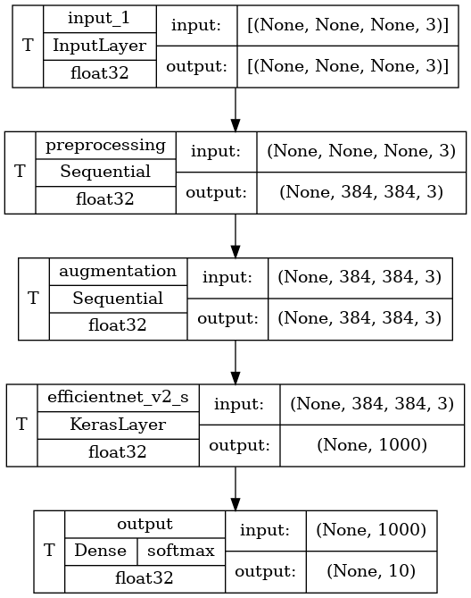

# Классификация животных по изображению
Датасет для обучения модели был взят с [*Kaggle*](https://www.kaggle.com/datasets/alessiocorrado99/animals10)

Протестировать работу модели можно на платформе [*Streamlit*](https://animal-classification-screameer.streamlit.app/)

На валидационной выборке модель имеет следующие показатели качества:
* *Accuracy* $\approx 0.98$
* $F_1$-score $\approx 0.98$

Весь процесс проделанной работы можно найти в [ноутбуке](./notebook/animal%20classification.ipynb)

## Архитектура используемой нейросети
1. **Предобработка входных данных**:
    * *Input*-слой - входное изображение размера $W \times H \times 3$, где $W$ - ширина изображения, $H$ - высота изображения, $3$ - количество каналов
    * *Resizing*-слой - изменение размера входного изображения $W \times H \times 3$ до необходимого $384 \times 384 \times 3$
    * *Rescaling*-слой - нормализация пикселей до диапазона $\{0;1\}$, где $0$ - отсутствие яркости пикселя (черный цвет), $1$ - максимальная яркость пикселя (белый цвет)

2. **Аугментация обучающей выборки**:
    * *RandomFlip*-слой - добавление зеркального отображения входных данных как по вертикальной, так и по горизонтальной оси
    * *RandomRotation*-слой - добавление случайного поворота изображения в диапазоне $\{-72\degree; 72\degree\}$

3. **EfficientNet V2** - предобученная на *ImageNet 1K* [модель от *Google*](https://www.kaggle.com/models/google/efficientnet-v2/frameworks/TensorFlow2/variations/imagenet1k-s-classification/versions/2), для простой задачи подойдет легковесная версия (с суффиксом *s* (*small*) в названии модели). Именно эта модель принимает на вход тензоры размера $384 \times 384 \times 3$. Используем *Fine-tuning* для решения поставленной задачи. Выход модели: 1000 нейронов, соответствует количеству классов, на котором обучалась нейросеть

4. **Выходной слой** - 10 нейронов (соответствует количеству классов в датасете) с активацией `softmax` для получения распределения вероятностей принадлежности входных объектов к классам

    </img>

## Пример использования нейросети для получения предсказаний
1. *Python 11.x*

2. Установить [зависимости](https://github.com/ScReameer/Animal-classification/blob/master/requirements.txt)  
    ```bash
    $ pip install -r requirements.txt
    ```

3. Сделать минимально необходимые импорты  
    ```Python
    import pandas as pd
    import numpy as np
    import os
    import tensorflow as tf
    import tensorflow_hub as hub
    import keras
    import requests
    import wget
    from PIL import Image
    ```

4. Добавить константу в код - словарь для обратной трансформации предсказанных классов из чисел в строки  
    ```Python
    INVERSE_TRANSFORM_DICT = {
        0: 'butterfly',
        1: 'cat',
        2: 'chicken',
        3: 'cow',
        4: 'dog',
        5: 'elephant',
        6: 'horse',
        7: 'sheep',
        8: 'spider',
        9: 'squirrel'
    }
    ```

5. Загрузить [модель](https://drive.google.com/uc?id=16vWem3RdeF6ZTt0G7OPI7aVx-2pmIX9q&export=download&confirm=yes)  
    ```Python
    folder_name='./model/'
    model_filename = folder_name + 'effnetv2.h5'
    # Download model if not already downloaded
    if not os.path.exists(folder_name): 
        os.mkdir(folder_name)
        url_model = r'https://drive.google.com/uc?id=16vWem3RdeF6ZTt0G7OPI7aVx-2pmIX9q&export=download&confirm=yes'
        wget.download(url_model, out=model_filename)
    # Load pretrained model
    model = keras.models.load_model(model_filename, custom_objects=dict(KerasLayer=hub.KerasLayer))
    ```

6. Инициализировать функцию для предсказания. Она возвращает кортеж из двух объектов: `label_prediction` - наиболее вероятный предсказанный класс изображения (`str`), `max_proba_label` - вероятность этого класса (`float`).  
    Функция имеет 1 обязательный аргумент:
    * `img_url` - источник изображения: может быть как путь к файлу `$PATH$/file.jpg`, так и ссылка на изображение из интернета `https://$url$/file.jpg`  
    ```Python
    def get_prediction(img_url:str) -> tuple:
        # Load image from web
        if 'https://' in img:
            img_raw = Image.open(requests.get(img_url, stream=True).raw)
        # Load image from local directory
        else:
            img_raw = Image.open(img_url)
        img_tensor = tf.convert_to_tensor(img_raw)
        # Transform prediction one-hot matrix to label via argmax
        def inverse_transform(labels:tf.Tensor) -> pd.Series:
            prediction = pd.Series(np.argmax(labels, axis=1)).map(INVERSE_TRANSFORM_DICT)
            return prediction
        # Get one-hot matrix of probabilities
        proba_prediction = model.predict(tf.expand_dims(img_tensor, axis=0), verbose=False)
        # Return most likely label and max probability
        label_prediction = inverse_transform(proba_prediction)[0]
        max_proba_label = proba_prediction.max()
        return label_prediction, max_proba_label
    ```

7. Пример получения предсказания для одного изображения:  
    ```Python
    img_url = r'https://upload.wikimedia.org/wikipedia/commons/0/0c/Cow_female_black_white.jpg'
    label_prediction, max_proba_label = get_prediction(img_url)
    print(f'Предсказанный класс изображения: {label_prediction}. Вероятность: {max_proba_label}')
    ```